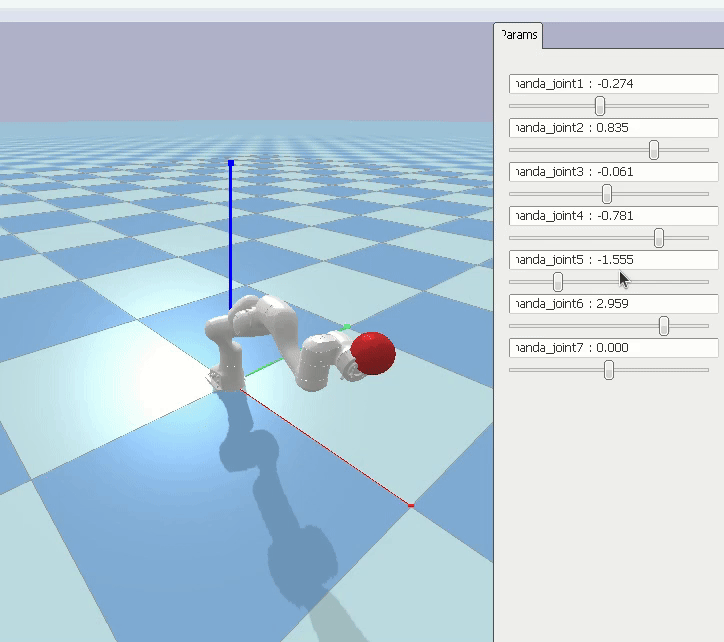

# URDF Visualizer with PyBullet
*A simple Python script to visualize URDF robot models in PyBullet without ROS dependencies.*



## Features
- **Visualize any .urdf or .urdf.xacro file** in PyBullet
- **No ROS required**
- **Support for mimic joints** (not supported in pybullet by default)
- **Integrated sliders** for joint movement testing
- **Easy-to-use CLI** for quick testing
<!-- - **Supports parameter tuning** (gravity, camera view, etc.) -->

---

## Installation
```bash
pip install pybullet xacro
git clone https://github.com/maschull106/urdf-visualizer.git
cd urdf-visualizer
```

## Usage
The [visualize python script](https://github.com/maschull106/urdf-visualizer/blob/main/visualize.py)
can take several CLI arguments, but none are mandatory.
Example usage:
```bash
python visualize.py --urdf="panda_urdf/hand.urdf" --fixed=true
```
To run the script with your URDF, you can also modify the [visualize python script](https://github.com/maschull106/urdf-visualizer/blob/main/visualize.py):
```py
DEFAULT_URDF_PATH = "path/to/your/urdf"
```

To make you robot fixed to the world, you can give the `--fixed=true` option as above, or add the 
```xacro
<gazebo>
    <static>true</static>
</gazebo>
```
element in your URDF (note that any static information from the URDF will be overridden if the `--fixed` CLI argument is provided).

### Available CLI argument

| Argument          | Description                                           | Default               |
|-------------------|-------------------------------------------------------|-----------------------|
| `--urdf`          | **string**: Path to URDF/Xacro file                   | `DEFAULT_URDF_PATH`   |
| `--fixed`         | **bool**: Fix the robot's base link to the world      | Decide from urdf      |
| `--self_collision`| **bool**: Check for self collisions                   | `False`               |
| `--gravity`       | **float**: Downwards gravitational force              | `9.81`                |
| `show_sidebars`   | **bool**: Show GUI sidebars (including joint sliders) | `True`                |
